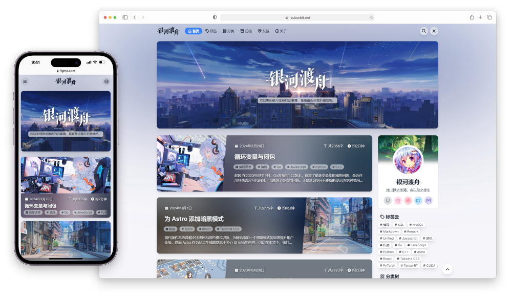

<h1 align="center">ME</h1>

写前端的刻猫猫的个人主页</b>

  
  
  
  
  
  
   

## Preview

Link: [https://keqing.zeabur.app/](https://keqing.zeabur.app/)

## Test

<picture>
  <source media="(prefers-color-scheme: dark)" srcset="https://github.com/keqing77/me/blob/output/github-contribution-grid-snake-dark.svg" />
  <source media="(prefers-color-scheme: light)" srcset="https://github.com/keqing77/me/blob/output/github-contribution-grid-snake.svg" />
  
</picture>

<!-- Made with https://platane.me/snk/ -->

## Todo

- Snake Contribution & github actions
- Responsive Design

## Contributors

<!-- Made with https://contrib.rocks/ -->
